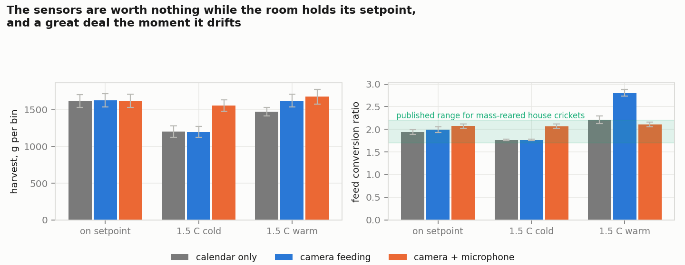
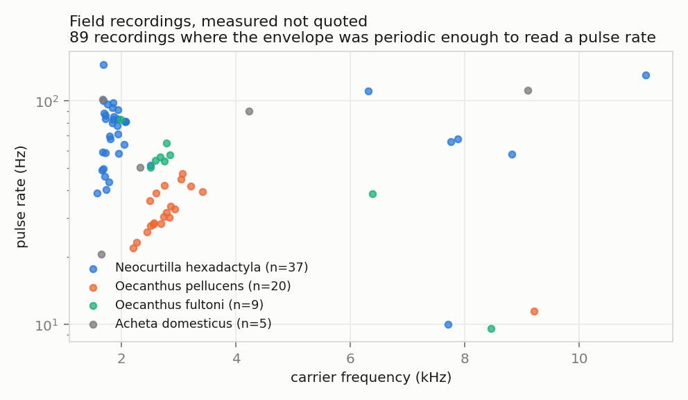
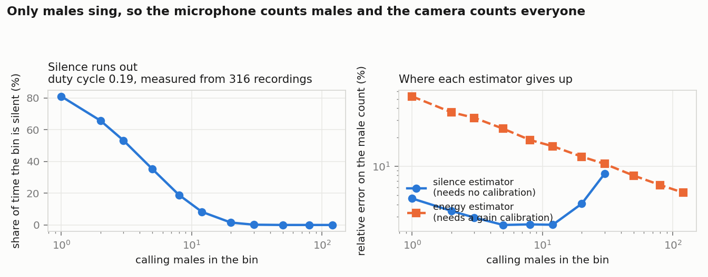
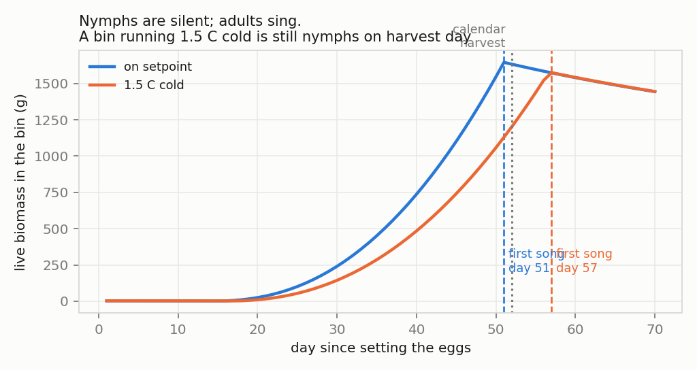

# Cricket farm control

**Running an insect farm off two sensors that already exist: a microphone that hears only the males, and a camera that sees everyone.**

---

> ### Source code is not public
>
> The pipeline is under active development. The repository is private; **the
> source is available for technical review under NDA** — contact me through the
> links at the end of this page. This page documents what was measured, what was
> modelled, and what came out.
>
> ### Status
>
> The song measurements are real, made on 319 openly licensed field recordings.
> The colony, the chorus and the policy comparison are **models**, with every
> parameter taken from the rearing literature and listed in
> `docs/references.md`. No data from a working cricket farm is used anywhere,
> and nothing here is presented as if it were.

---

## The two facts the whole design rests on

1. **Only males stridulate, and only as adults.** A microphone in a rearing bin
   therefore measures males, and a bin of nymphs is silent. The day it starts
   singing is the day the cohort has reached adulthood.
2. **A camera counts everyone.** Divide the acoustic male count by the camera
   total and you have the sex ratio, continuously, without emptying the bin
   onto a tray and sorting by ovipositor.

Everything below is what those two facts are actually worth, in grams.

## What was measured

319 recordings of crickets were fetched from iNaturalist under open licences
(attribution for every file is recorded, per the licence terms). These are amateur field recordings — phones, wind,
traffic — which is the point: a farm microphone is a cheap microphone in a room
with fans running.

First, a hygiene step that turned out to matter. Searching by name returns
things that are not crickets: *Acris gryllus* is a **frog**, and it arrives on a
cricket search because of its species epithet. An ancestry check against iNaturalist filters this: it checks the
ancestry of every taxon against iNaturalist and keeps Orthoptera only — 22 taxa
of 23, 313 recordings of 319.

| | |
|---|---|
| Recordings with a carrier at least 10 dB above background | **311** |
| Of those, with an envelope periodic enough to read a pulse rate | **89** |

| Taxon | n | Carrier, kHz | Pulse rate, Hz (n) | Duty cycle |
|---|---|---|---|---|
| *Gryllus bimaculatus* | 50 | 4.75 ± 1.09 | 132.8 ± 19.8 (3) | 0.23 |
| *Gryllus campestris* | 50 | 4.47 ± 0.94 | 45.0 ± 23.4 (4) | 0.21 |
| *Acheta domesticus* | 50 | 3.73 ± 1.93 | 74.9 ± 34.2 (5) | 0.16 |
| *Oecanthus fultoni* | 49 | 2.62 ± 1.35 | 52.0 ± 18.7 (9) | 0.17 |
| *Neocurtilla hexadactyla* | 39 | 3.02 ± 2.50 | 74.2 ± 25.6 (37) | 0.23 |
| *Oecanthus pellucens* | 27 | 2.86 ± 1.31 | 32.2 ± 8.4 (20) | 0.16 |

Three things worth reading off that table.

*Oecanthus fultoni* comes out at 2.62 kHz against a published 2.6 kHz, which is
the pipeline validating itself on the one species with a well known carrier.
*Acheta domesticus* comes out at 3.73 ± 1.93 kHz against a published 4.8 kHz —
the farmed species is the one the field archive is worst at, because it is
recorded indoors, at a distance, by people who are not sure what they are
pointing at. And the pulse rate resolves in 37 of 39 mole-cricket recordings
but in only 3 of 50 *G. bimaculatus*: a continuous trill is easy to measure, a
chirp in a noisy room is not. A farm that wants pulse rate needs a microphone
in the bin, not across the room.

## Counting males without touching them

Two estimators of the number of calling males, both running on the same signal:

- **silence** — the share of time nobody is singing. If each male sings with
  duty cycle *d*, that share is (1−*d*)^N, which inverts to N. It needs no
  calibration at all: no microphone gain, no distances. And it runs out, because
  once the bin is never silent the measurement is spent.
- **energy** — band energy adds over incoherent sources, so it grows linearly in
  N and never saturates. It does need the mean per-male level, which is exactly
  what drifts as animals move around the bin.

The duty cycle is not assumed: it is the median of the field recordings, 0.19.

| Calling males | Silence estimator | Energy estimator |
|---|---|---|
| 5 | **2.4 %** | 24.5 % |
| 12 | 2.5 % | 16.1 % |
| 30 | 8.4 % | 10.6 % |
| 50 | unusable | 8.0 % |
| 120 | unusable | 5.3 % |

So the calibration-free method is the better one up to about **30 calling
males** and dead by 50. That maps onto a real split in how a farm is laid out:
breeding bins hold tens of adults and can be run on silence alone; production
bins hold hundreds and need the calibrated channel.

## What the sensors are worth, in grams

A cohort of 6,000 eggs in one bin, 300 Monte Carlo runs per condition, three
ways of running it:

- **calendar** — a fixed daily ration worked out in advance, harvest on a fixed
  day. This is how most small farms run, and it is the control.
- **camera** — ration follows a camera estimate of how many are alive and how
  big they are; harvest still on the calendar.
- **camera + microphone** — ration follows the camera, harvest is triggered by
  the first song.

| Condition | Policy | Harvest, g | FCR | Day |
|---|---|---|---|---|
| on setpoint | calendar | 1619 ± 85 | 1.94 | 52 |
| | camera | 1627 ± 90 | 1.99 | 52 |
| | camera + mic | 1621 ± 89 | 2.07 | 52.5 |
| 1.5 °C cold | calendar | 1203 ± 77 | 1.77 | 52 |
| | camera | 1199 ± 75 | 1.77 | 52 |
| | **camera + mic** | **1557 ± 79** | 2.07 | 58.2 |
| 1.5 °C warm | calendar | 1472 ± 59 | 2.21 | 52 |
| | camera | 1625 ± 90 | **2.81** | 52 |
| | **camera + mic** | **1678 ± 98** | **2.11** | 47.9 |

On setpoint the sensors are worth nothing, and the honest thing is to say so.

Everything they are worth appears when the room drifts by a degree and a half,
which is what rooms do. Run cold and the calendar harvests nymphs: 1203 g
against 1557 g, **+29 %**, because the microphone waits six more days for the
cohort to actually mature. Run warm and the camera alone is the worst of the
three on feed — FCR 2.81 against 2.11 — because it dutifully feeds adults that
should already have been harvested. The camera decides how much to feed; the
microphone decides when to stop.

## Model discipline

The colony model has **one** free parameter, the coefficient in the metabolic
feed demand. It is set so that a bin fed exactly to demand at the design
temperature comes out at a feed conversion ratio of 1.99, inside the 1.7–2.2
reported for mass-reared house crickets. Everything else — 765 degree-days from
egg to adult, 10 moults, 500 mg adults, crowding past one animal per 2.5 cm² —
is from the literature, cited under Sources.

That matters because the headline result is a *difference between policies*, and
a difference is only as good as the model it is computed in. The FCR panel above
is there so the model can be caught being wrong.

## What this does not claim

- That any of this has been run on a farm. It has not.
- That the acoustic male count works at production density without calibration.
  It does not — the number is 30 animals, and it is in the table.
- That sexing can be done acoustically at the individual level. It cannot; the
  method is a ratio of two population counts, and it needs the camera.

## Sources

Patton (1978), *Growth and development parameters for Acheta domesticus*, Ann.
Entomol. Soc. Am. 71(1) 40–42 · Dolbear (1897), *The cricket as a thermometer*,
Am. Nat. 31, 970–971 · Weissman & Gray (2019) via Singing Insects of North
America · recordings from iNaturalist contributors under CC0 / CC BY / CC BY-SA
/ CC BY-NC / CC BY-NC-SA, individually attributed in the attribution table held with the source.

## Contact

**Prof. Dr. Dmitry Mikhaylov** — Abu Dhabi, UAE

[LinkedIn](https://www.linkedin.com/in/dmitry-mikhaylov) ·
[ORCID](https://orcid.org/0009-0009-2108-6820) ·
[Substack](https://dmitrymikhaylov.substack.com)
