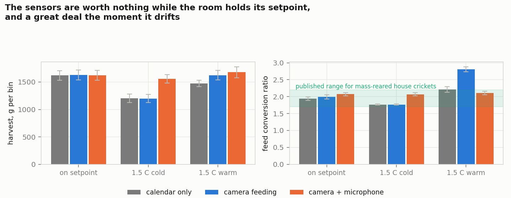
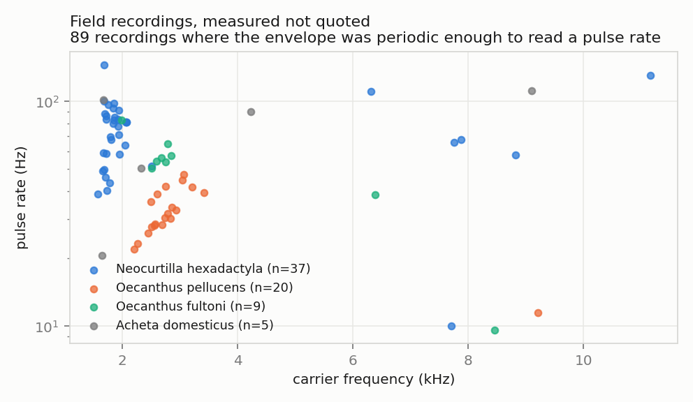
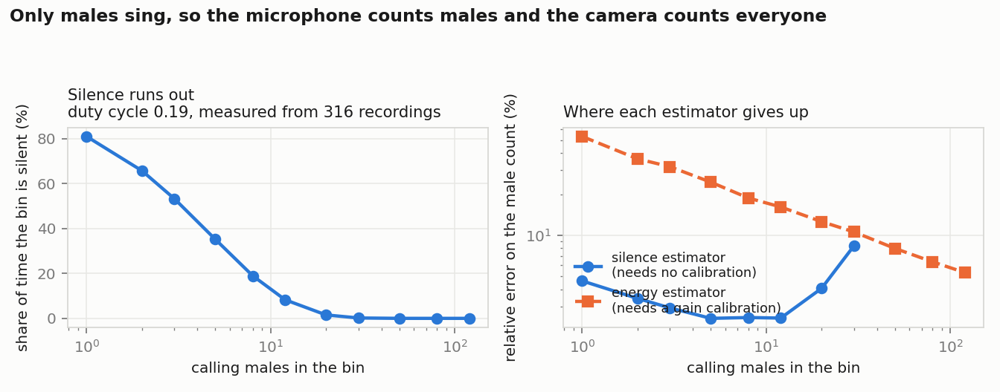
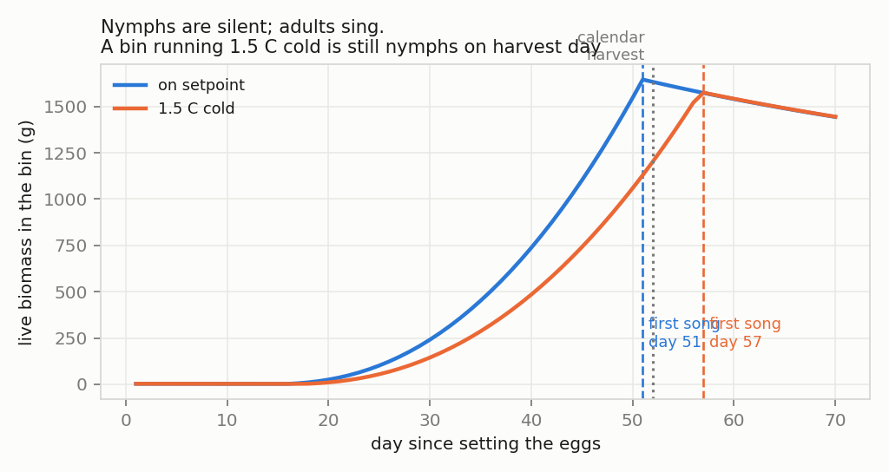

# Cricket farm control

**Running an insect farm off two sensors that already exist: a microphone that hears only the males, and a camera that sees everyone.**

---

> ### Source code is not public
>
> The pipeline is under active development. The repository is private; **the
> source is available for technical review under NDA** – contact me through the
> links at the end of this page. This page documents what was measured, what was
> modelled, and what the models returned.
>
> ### Status
>
> The song measurements are real, made on 319 openly licensed field recordings.
> The colony, the chorus and the policy comparison are **models**, with every
> parameter taken from the rearing literature and listed in
> `docs/references.md`. No data from a working cricket farm is used anywhere,
> and nothing here is presented as if it were.

---

## Before the repo

I built insect-farming technology from the ground up, from a Singapore start-up with a Belgian research partner to working cricket and black soldier fly farms in Vietnam and Uzbekistan. Microphones and cameras in the rearing rooms, models that knew what the insects needed before the calendar did. Two papers came out of it in 2023, in *IOP Conference Series: Earth and Environmental Science* (audio analysis in insect farms in Uzbekistan) and *Sustainable Agriculture Research* 12(1) (a hardware-software module monitoring *Acheta domesticus*). This repository is that know-how, rebuilt on open recordings so anyone can run it.

## Two facts: males sing, cameras count

1. **Only males stridulate, and only as adults.** A microphone in a rearing bin
   therefore measures males, and a bin of nymphs is silent. The day it starts
   singing is the day the cohort has reached adulthood.
2. **A camera counts everyone.** Divide the acoustic male count by the camera
   total and you have the sex ratio, continuously. Nobody has to empty the bin
   onto a tray and sort by ovipositor.

Everything below is what those two facts are actually worth, in grams.

## Recordings: 319 files, 22 taxa, one frog

319 recordings of crickets were fetched from iNaturalist under open licences.
Attribution for every file is recorded, per the licence terms. These are
amateur field recordings – phones, wind, traffic – which is the point. A farm
microphone is a cheap microphone in a room with fans running.

First, a hygiene step that turned out to matter. Searching by name returns
things that are not crickets. *Acris gryllus* is a **frog**, and it arrives on
a cricket search because of its species epithet. An ancestry check against
iNaturalist filters this. It checks the ancestry of every taxon and keeps
Orthoptera only: 22 taxa of 23, 313 recordings of 319.

| | |
|---|---|
| Recordings with a carrier at least 10 dB above background | **311** |
| Of those, with an envelope periodic enough to read a pulse rate | **89** |

| Taxon | n | Carrier, kHz | Pulse rate, Hz (n) | Duty cycle |
|---|---|---|---|---|
| *Gryllus bimaculatus* | 50 | 4.75 ± 1.09 | 132.8 ± 19.8 (3) | 0.23 |
| *Gryllus campestris* | 50 | 4.47 ± 0.94 | 45.0 ± 23.4 (4) | 0.21 |
| *Acheta domesticus* | 50 | 3.73 ± 1.93 | 74.9 ± 34.2 (5) | 0.16 |
| *Oecanthus fultoni* | 49 | 2.62 ± 1.35 | 52.0 ± 18.7 (9) | 0.17 |
| *Neocurtilla hexadactyla* | 39 | 3.02 ± 2.50 | 74.2 ± 25.6 (37) | 0.23 |
| *Oecanthus pellucens* | 27 | 2.86 ± 1.31 | 32.2 ± 8.4 (20) | 0.16 |

Three things are worth reading off that table.

*Oecanthus fultoni* comes out at 2.62 kHz against a published 2.6 kHz. That is
the pipeline validating itself on the one species with a well known carrier.
*Acheta domesticus* comes out at 3.73 ± 1.93 kHz against a published 4.8 kHz.
The farmed species is the one the field archive is worst at, because it is
recorded indoors, at a distance, by people who are not sure what they are
pointing at. And the pulse rate resolves in 37 of 39 mole-cricket recordings
but in only 3 of 50 *G. bimaculatus*. A continuous trill is easy to measure; a
chirp in a noisy room is not. A farm that wants pulse rate needs a microphone
in the bin, not across the room.

## Carrier column: a mixture, not a mean

**A fourth point, on re-reading: the ± in the carrier column is not a spread.**
The per-recording carriers are in `results/song_measurements.json`. Read as a
histogram (`results/carrier_clusters.json`), the farmed species splits in two.
27 of the 50 *Acheta domesticus* recordings sit in 3.5 to 6 kHz at
**4.53 ± 0.34 kHz**, which is within the published 4.8 kHz and as tight as the
two *Gryllus* species. 19 sit below 2.5 kHz, where the peak picker has locked
onto room noise, a fan or a low harmonic of something else, and 3 sit above
6 kHz. The mean of 3.73 ± 1.93 is the average of two clusters that should not
be averaged. The paragraph above blaming distance and indoor recording is
only half the story. The pipeline has no way to reject a recording whose
loudest stable tone is not the cricket.

The same happens to the mole cricket: mean 3.02 ± 2.50, median **1.85**, 32 of
39 in a 1.5 to 3.5 kHz band at 1.89 ± 0.33, and 7 recordings above 6 kHz.
Medians, and the in-band mean with its count, are the numbers to quote. The
table's mean ± sd stays as it was so the change is visible.

| Taxon | published, kHz | median | in band | in-band mean | below 2.5 | above 6 |
|---|---|---|---|---|---|---|
| *Acheta domesticus* | 4.8 | 4.28 | 27 / 50 | 4.53 ± 0.34 | 19 | 3 |
| *Gryllus bimaculatus* | 4.8 | 4.84 | 45 / 50 | 4.83 ± 0.38 | 1 | 1 |
| *Gryllus campestris* | 4.5 | 4.71 | 43 / 50 | 4.75 ± 0.27 | 4 | 1 |
| *Oecanthus fultoni* | 2.6 | 2.24 | 45 / 49 | 2.25 ± 0.36 | – | 3 |
| *Oecanthus pellucens* | 2.5 | 2.69 | 26 / 27 | 2.62 ± 0.42 | – | 1 |
| *Neocurtilla hexadactyla* | 2.0 | 1.85 | 32 / 39 | 1.89 ± 0.33 | – | 7 |

*Band: 3.5 to 6 kHz for the field crickets, 1.5 to 3.5 kHz for the tree and
mole crickets; carrier at least 10 dB above background; ± is the sample sd.*

## Counting males: two estimators on one signal

Two estimators of the number of calling males run on the same signal:

- **silence** – the share of time nobody is singing. If each male sings with
  duty cycle *d*, that share is (1−*d*)^N, which inverts to N. It needs no
  microphone gain and no distances. It does need *d*. The first version of
  this page said "no calibration at all"; the section after the table shows
  what that left out. And it runs out, because once the bin is never silent
  the measurement is spent.
- **energy** – band energy adds over incoherent sources, so it grows linearly
  in N and never saturates. It does need the mean per-male level, which is
  exactly what drifts as animals move around the bin.

The duty cycle is not assumed. It is the median of the field recordings, 0.19.

| Calling males | Silence estimator | Energy estimator |
|---|---|---|
| 5 | **2.4 %** | 24.5 % |
| 12 | 2.5 % | 16.1 % |
| 30 | 8.4 % | 10.6 % |
| 50 | unusable | 8.0 % |
| 120 | unusable | 5.3 % |

The energy column is the spread only. The estimator also carries a bias the
table does not show. It reads **8 % low at every count** (−7.6 to −10.9 %
across 1 to 120 males, `results/chorus.json`). The reason first given here, a
median level pulled up by a loud tail, was wrong. The simulation calibrates the
estimator on 200 single-male runs, and that calibration sample averaged 8.6 %
above the level it was drawn from, which is 2.0 standard errors when levels
differ between males by 60 %. The bias is that one draw. Another 200 males
would give another number, of either sign. So the calibration does not absorb
the bias, it is the bias: a farm that calibrates on one known male carries a
constant error with a standard deviation of 60 %, on ten males 19 %. The
silence estimator shows no bias here (|bias| < 0.5 % up to 20 males), for the
reason taken apart in the next section.

So the calibration-free method is the better one up to about **30 calling
males** and dead by 50. That maps onto a real split in how a farm is laid out.
Breeding bins hold tens of adults and can be run on silence alone. Production
bins hold hundreds and need the calibrated channel.

## The duty cycle: the one number the silence estimator needs

*Added 2026-10-06, from `results/duty_cycle_check.json`.*

The table above gives the silence estimator 2.4 % at five males. That figure
comes from a simulation in which every male sings with the same duty cycle,
0.188, and the estimator is handed that same number. Each male does get his
own level, with a 60 % spread. So the energy column carries the differences
between animals and the silence column carries none. This section puts them
back.

**What an error in *d* costs.** The estimate is ln(silence) / ln(1 − *d*). A
bin whose males sing at *d* while the estimator assumes 0.188 reads
ln(1 − *d*) / ln(1 − 0.188) of the true count. One percentage point of duty
cycle is **5.9 %** of the count. A count good to ± 5 % needs *d* to ± 0.008.

**What the recordings say about *d*.** The 0.188 is the median of 316 recordings.
Six of them are the frog that the ancestry check removes from the song table;
the duty-cycle median was taken before that filter. Without them it is 0.189,
so nothing moves. The 95 % interval of that median, from order statistics, is
0.175 to 0.199, which is already 0.92 to 1.06 of the true count. The spread
between recordings is far wider. The quartiles are 0.10 and 0.26: a bin at the
lower quartile reads **0.52** of its males, a bin at the upper quartile **1.43**.

| Taxon | n | Median duty cycle | Quartiles | Count read when 0.188 is assumed |
|---|---|---|---|---|
| *Acheta domesticus* | 50 | 0.170 | 0.088 – 0.212 | 0.89 |
| *Gryllus bimaculatus* | 50 | 0.227 | 0.163 – 0.307 | 1.23 |
| *Gryllus campestris* | 50 | 0.235 | 0.180 – 0.266 | 1.29 |
| *Oecanthus fultoni* | 49 | 0.147 | 0.104 – 0.228 | 0.76 |
| *Oecanthus pellucens* | 26 | 0.126 | 0.069 – 0.255 | 0.64 |
| *Neocurtilla hexadactyla* | 39 | 0.237 | 0.179 – 0.296 | 1.30 |

*n is the number of recordings with a measurable duty cycle (26 of the 27
Oecanthus pellucens). Last column: ln(1 − median) / ln(1 − 0.188).*

The farmed species reads 11 % low on its own median, and 13 % low when the
males in the bin differ as its recordings do. A bin that is half male then
reads as 44 % male with a perfect camera.

**The number follows the recording, not only the animal.** The duty cycle is
the share of the envelope above a threshold set from the same recording, its
median plus two robust standard deviations. Across the 316 recordings it rises
with the carrier's signal-to-noise ratio: Spearman ρ = **0.49**
(p = 3 × 10⁻²⁰), and 0.45 within the 50 *Acheta domesticus* recordings
(p = 0.001). By thirds of signal-to-noise the median is 0.13, 0.19 and 0.26,
which is 0.66, 1.00 and 1.44 of the count. The same measure
returns 0.03 on band noise with no song in it and 0.02 on an uninterrupted
tone, and cannot exceed 0.5 by construction. 27 of the 316 recordings sit below
twice the noise value. So "measured, not assumed" is true, and part of what was
measured is how close the phone was.

**A bin whose males differ.** The chorus simulation was run again with each
male drawing his duty cycle from the 50 *Acheta domesticus* recordings. Same
200 ten-minute windows per count, same seeds, estimator told 0.188.

| Calling males | Silence, as published | Silence, males differ | Energy, as published | Energy, males differ |
|---|---|---|---|---|
| 5 | 2.4 % | **19.2 %** | 24.5 % | 27.7 % |
| 12 | 2.5 % | **14.1 %** | 16.1 % | 20.1 % |
| 30 | 8.4 % | **10.5 %** | 10.6 % | 12.4 % |

*Spread of the estimate over the 200 windows, as a share of the true count.*

On top of that spread the silence estimator reads 13 to 17 % low over the
eight counts from 1 to 30. Told the species median, 0.170, it reads 2 to 7 %
low. The energy estimator, calibrated at 0.188, reads 19 to 26 % low.

The silence estimator is still ahead of the energy estimator at every count up
to 30. It is ahead by a factor of 1.2 to 1.5, not ten. Its spread is now
close to what the differences between males predict on their own,
21 %, 14 % and 9 % at 5, 12 and 30 males. It is set by which males are in the
bin, so a longer listening window does not reduce it. "Run breeding bins on
silence alone" should read: on silence, after measuring the duty cycle of that
colony's males on that microphone.

**What this does not show.** The spread between 50 phone recordings is not the
spread between males of one colony. It includes the recorder, the distance and
the signal-to-noise effect above. So 19 % at five males is most likely too
high, and the published 2.4 % is a floor. Where a real bin sits between them needs
recordings of individual males from one colony, and this repository has none.
The 60 % level spread behind the energy column is an assumption of the same
kind. People record a cricket because it is singing, so nothing here says what
share of the males in a bin call at all. The saturation limit, about 30 males,
does not move.

## Policy runs: what the sensors buy

A cohort of 6,000 eggs in one bin, 300 Monte Carlo runs per condition, three
ways of running it:

- **calendar** – a fixed daily ration worked out in advance, harvest on a fixed
  day. This is how most small farms run, and it is the control.
- **camera** – ration follows a camera estimate of how many are alive and how
  big they are; harvest still on the calendar.
- **camera + microphone** – ration follows the camera, harvest is triggered by
  the first song.

| Condition | Policy | Harvest, g | FCR | Day |
|---|---|---|---|---|
| on setpoint | calendar | 1619 ± 85 | 1.94 | 52 |
| | camera | 1627 ± 90 | 1.99 | 52 |
| | camera + mic | 1621 ± 89 | 2.07 | 52.5 |
| 1.5 °C cold | calendar | 1203 ± 77 | 1.77 | 52 |
| | camera | 1199 ± 75 | 1.77 | 52 |
| | **camera + mic** | **1557 ± 79** | 2.07 | 58.2 |
| 1.5 °C warm | calendar | 1472 ± 59 | 2.21 | 52 |
| | camera | 1625 ± 90 | **2.81** | 52 |
| | **camera + mic** | **1678 ± 98** | **2.11** | 47.9 |

### On setpoint: nothing gained, feed lost

On setpoint the sensors are worth nothing in grams, and that should be said
plainly, along with what they cost. With 300 runs per arm the differences
against the calendar policy carry 95 % intervals of about ± 13 g
(`results/policy_differences.json`). On setpoint, camera is **+8 ± 14 g** and
camera + microphone **+2 ± 14 g**, both compatible with zero. Feed is not.
Camera + microphone runs FCR **+0.14 ± 0.01** above calendar, seven percent
more feed for the same harvest, because it waits half a day past the calendar
for the first song and feeds adults meanwhile. The earlier wording "worth
nothing" understated that. On a well-controlled room the microphone is a small
net cost.

### Off setpoint: where the gain is

Everything they are worth appears when the room drifts by a degree and a half,
which is what rooms do. Run cold and the calendar harvests nymphs: 1203 g
against 1557 g, **+29 %**, because the microphone waits six more days for the
cohort to actually mature. Run warm and the camera alone is the worst of the
three on feed, FCR 2.81 against 2.11, because it dutifully feeds adults that
should already have been harvested. The camera decides how much to feed. The
microphone decides when to stop.

With intervals: cold, camera + microphone is **+354 ± 12 g** (+29 %), and the
calendar and camera-only arms harvest **0 %** of the cohort as adults against
100 % for the microphone arm. Warm, camera alone is **+153 ± 12 g** (+10 %)
over calendar. That is a real gain the text above does not mention, bought
with FCR +0.60 ± 0.01. Camera + microphone is **+207 ± 13 g** (+14 %) at FCR
−0.10 ± 0.01, i.e. more crickets on less feed, harvested four days early.

## Model discipline: one free parameter

The colony model has **one** free parameter, the coefficient in the metabolic
feed demand. It is set so that a bin fed exactly to demand at the design
temperature comes out at a feed conversion ratio of 1.99, inside the 1.7 to
2.2 reported for mass-reared house crickets. Everything else is from the
literature, cited under Sources: 765 degree-days from egg to adult, 10 moults,
500 mg adults, crowding past one animal per 2.5 cm².

That matters because the headline result is a *difference between policies*,
and a difference is only as good as the model it is computed in. The FCR panel
above is there so the model can be caught being wrong.

## Known gaps

- None of this has been run on a farm.
- The acoustic male count does not work at production density without
  calibration. The number is 30 animals, and it is in the table.
- The silence count is only as good as the duty cycle it is given. A count to
  ± 5 % needs it to ± 0.008, and the field recordings place it between 0.10 and
  0.26 (quartiles), rising with recording quality.
- Sexing cannot be done acoustically at the individual level. The method is a
  ratio of two population counts, and it needs the camera.

## Second readings: how the page changed

The carrier table was the first thing I got wrong. The original explanation for
*Acheta domesticus* at 3.73 ± 1.93 kHz was "recorded indoors, at a distance".
When I plotted the per-recording carriers as a histogram, 27 of the 50 sat
tightly at 4.53 ± 0.34 kHz and 19 sat below 2.5 kHz. The quoted mean was an
average of two clusters, and the real fault was that the peak picker cannot
reject a tone that is not a cricket. I added medians and in-band means for all
six taxa and left the original column in place.

The policy comparison was the second. "Worth nothing on setpoint" was too kind
once the 95 % intervals were attached: the grams are zero, but the microphone
arm costs FCR +0.14 ± 0.01. The same pass showed that the camera-only arm gains
+153 ± 12 g when the room runs warm, which the first draft had not stated. The
energy estimator's 8 % low bias was also unstated before. The result files and
`tests/test_readme_numbers.py` (6 tests) went up at the same time.

The third was the silence estimator, on 6 October 2026. "No calibration at
all" hid the duty cycle. The simulation gave every male the same one and told
the estimator what it was, so its 2.4 % was the error of an estimator that
already knew the answer to the only question it could get wrong. With duty
cycles drawn from the *Acheta domesticus* recordings the figure is 19.2 %, and
the lead over the energy estimator shrinks from tenfold to 1.2 to 1.5. The same
pass found that my explanation of the energy estimator's 8 % bias was wrong:
it is the calibration sample, not the loud tail.

## Result files: checking the numbers

`results/` holds the files behind every table: `song_summary.json` and
`song_measurements.json` (one row per recording), `chorus.json`,
`policies.json` (mean, sd, n per condition and policy), the two derived
files above, and `duty_cycle_check.json`. `tests/test_readme_numbers.py` and
`tests/test_duty_cycle.py` recompute every number on this page from them;
`python -m pytest tests/`.

## Sources

Patton (1978), *Growth and development parameters for Acheta domesticus*, Ann.
Entomol. Soc. Am. 71(1) 40–42 · Dolbear (1897), *The cricket as a thermometer*,
Am. Nat. 31, 970–971 · Weissman & Gray (2019) via Singing Insects of North
America · recordings from iNaturalist contributors under CC0 / CC BY / CC BY-SA
/ CC BY-NC / CC BY-NC-SA, individually attributed in the attribution table held with the source.

## Contact

**Prof. Dr. Dmitry Mikhaylov** – Abu Dhabi, UAE

[LinkedIn](https://www.linkedin.com/in/dmitry-mikhaylov) ·
[ORCID](https://orcid.org/0009-0009-2108-6820) ·
[Substack](https://dmitrymikhaylov.substack.com)
